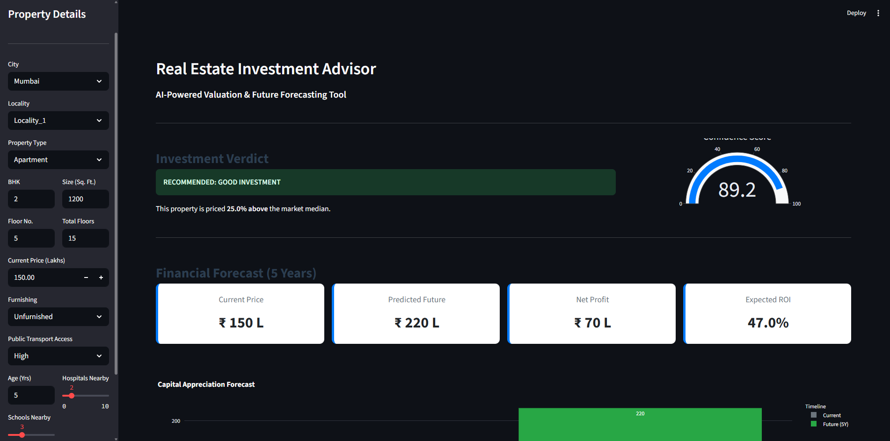
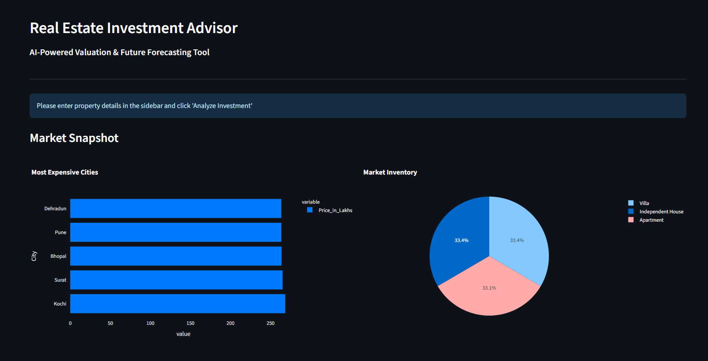

# Real Estate Investment Advisor

[](https://www.python.org/downloads/)
[](https://streamlit.io/)
[](https://scikit-learn.org/)
[](LICENSE)

An AI-powered web application that helps investors make data-driven real estate investment decisions in the Indian housing market. The system uses machine learning models to predict property investment viability and forecast future prices based on comprehensive property and location features.

## Features

- **Investment Classification**: ML-powered recommendation system that classifies properties as "Good Investment" or "High Risk"
- **Price Forecasting**: 5-year price prediction using regression models
- **Market Benchmarking**: Compares property prices against city-specific market medians
- **ROI Calculation**: Automatic calculation of expected return on investment
- **Interactive Dashboard**: Beautiful, responsive Streamlit interface with real-time predictions
- **Comprehensive Validation**: Input validation to prevent errors and ensure data quality
- **Market Insights**: Visual analytics showing market trends and property distribution

## Key Capabilities

- **Predicts** whether a property is a good investment opportunity  
- **Forecasts** property value 5 years into the future  
- **Calculates** expected ROI and net profit  
- **Analyzes** 18 property features including location, size, amenities, and infrastructure  
- **Visualizes** investment metrics with interactive charts  
- **Validates** user inputs to prevent nonsensical predictions  

## Tech Stack

### Machine Learning
- **scikit-learn** - Model training and prediction
- **MLflow** - Experiment tracking and model management
- **pandas & numpy** - Data processing and feature engineering

### Web Application
- **Streamlit** - Interactive web interface
- **Plotly** - Interactive visualizations
- **Python 3.8+** - Core programming language

### Models
- **Classification**: Gradient Boosting Classifier (99.89% accuracy)
- **Regression**: Random Forest Regressor (R² = 0.9872)

## Installation

### Prerequisites
- Python 3.8 or higher
- pip package manager

### Setup

1. **Clone the repository**
```bash
git clone https://github.com/yourusername/Real-Estate-Investment-Advisor.git
cd Real-Estate-Investment-Advisor
```

2. **Create a virtual environment** (recommended)
```bash
python -m venv venv

# On Windows
venv\Scripts\activate

# On macOS/Linux
source venv/bin/activate
```

3. **Install dependencies**
```bash
pip install -r requirements.txt
```

4. **Verify data and models are present**
- Ensure `data/processed_housing_data.csv` exists
- Ensure `best-models/` directory contains:
  - `best_model_classification.pkl`
  - `best_model_regression.pkl`

## Usage

### Running the Application

```bash
streamlit run app.py
```

The application will open in your default web browser at `http://localhost:8501`

### Making Predictions

1. **Select Location**: Choose city and locality from dropdowns
2. **Enter Property Details**: 
   - Property type (Apartment/Villa/Independent House)
   - BHK, size in sq.ft, floor details
   - Current price in Lakhs
3. **Add Features**: Furnishing status, transport access, nearby amenities
4. **Analyze**: Click "Analyze Investment" button
5. **Review Results**: Get instant investment recommendation, price forecast, and ROI

## Project Structure

```
Real-Estate-Investment-Advisor/
│
├── app.py                          # Main Streamlit application
├── requirements.txt                # Python dependencies
├── README.md                       # Project documentation
│
├── data/
│   ├── india_housing_prices.csv   # Raw dataset
│   └── processed_housing_data.csv # Processed dataset
│
├── best-models/
│   ├── best_model_classification.pkl  # Investment classifier
│   └── best_model_regression.pkl      # Price predictor
│
├── notebooks/
│   ├── EDA.ipynb                  # Exploratory Data Analysis
│   ├── data-processing.ipynb      # Data preprocessing pipeline
│   └── Model-Training.ipynb       # Model training & evaluation
│
└── mlruns/                        # MLflow experiment tracking
```

## Model Details

### Features Used (18 Total)
The models are trained on the following features:

**Categorical Features:**
- City, Locality, Property Type
- Furnished Status, Public Transport Accessibility

**Numerical Features:**
- BHK, Size (sq.ft), Price (Lakhs), Price per sq.ft
- City Median Price, Floor Number, Total Floors
- Age of Property, Nearby Schools, Nearby Hospitals
- Infrastructure Score, Average Room Size, Floor Ratio

### Model Performance

**Classification Model (Good Investment Prediction)**
- Algorithm: Gradient Boosting Classifier
- Accuracy: 99.89%
- F1 Score: 0.9989
- Precision/Recall: 1.00/1.00

**Regression Model (Price Forecasting)**
- Algorithm: Random Forest Regressor
- R² Score: 0.9872
- RMSE: 23.35 Lakhs
- MAE: 17.66 Lakhs

### Training Details
- Dataset: 250,000 Indian housing properties
- Train/Test Split: 80/20
- Preprocessing: StandardScaler for numerical, OneHotEncoder for categorical
- Feature Engineering: Target encoding for high-cardinality features (Locality)

## How It Works

1. **Data Input**: User enters property details through the sidebar
2. **Validation**: System validates inputs for logical consistency
3. **Feature Engineering**: Calculates derived features (price per sq.ft, floor ratio, etc.)
4. **Market Analysis**: Compares property against city median prices
5. **ML Prediction**: 
   - Classification model predicts investment viability
   - Regression model forecasts 5-year price
6. **Results Display**: Shows verdict, confidence score, ROI, and visualizations

## Configuration

### Model Training
To retrain models with new data:
1. Update `data/processed_housing_data.csv`
2. Run `Model-Training.ipynb` notebook
3. New models will be saved in `best-models/` directory

### Customization
- Modify city list: Edit data CSV
- Adjust validation ranges: Edit validation logic in `app.py` (lines 136-154)
- Change UI styling: Update CSS in `app.py` (lines 16-32)

## Key Insights from Data Analysis

- **Dataset Size**: 250,000 properties across 43 Indian cities
- **Price Range**: ₹1 Lakh to ₹10,000 Lakhs
- **Most Expensive Cities**: Mumbai, Bangalore, Delhi, Pune, Hyderabad
- **Property Types**: Apartments (60%), Villas (25%), Independent Houses (15%)
- **Average ROI**: Properties show ~48% appreciation over 5 years

## Results





## Important Notes

### Data Units
- **Price**: Always in Lakhs (1 Lakh = 100,000 rupees)
- **Size**: Square feet
- **Price per sq.ft**: Calculated in Lakhs per sq.ft (not rupees)

### Limitations
- Predictions based on historical data patterns (2011-2025)
- Market conditions may change due to external factors
- Model trained on Indian real estate market only
- Future predictions assume consistent growth patterns

## Troubleshooting

**Issue: App won't start**
- Ensure all dependencies are installed: `pip install -r requirements.txt`
- Check Python version: `python --version` (should be 3.8+)

**Issue: Models not found**
- Verify `best-models/` directory contains both .pkl files
- Run Model-Training.ipynb to generate models

**Issue: Data not loading**
- Ensure `data/processed_housing_data.csv` exists
- Check file permissions
